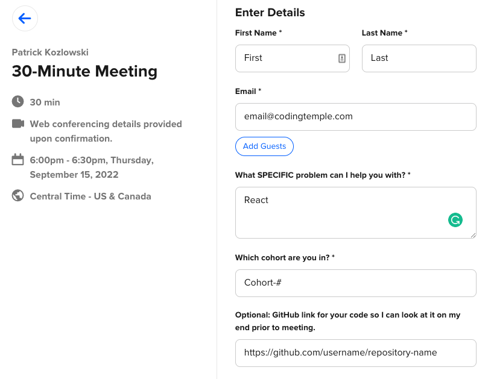
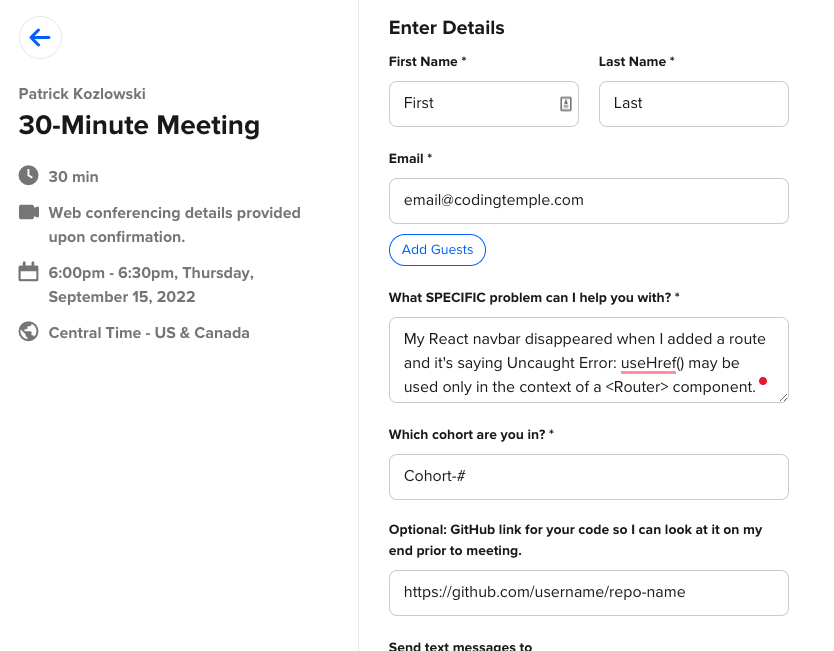

# Purpose

Asking thoughtful technical questions is an excellent skill to develop. This skill will transcend your time at Coding Temple and will be useful throughout your career. The better you get at asking precise questions, the easier it will be to navigate platforms and forums with stricter requirements, the most popular one being Stack Overflow. An excellent guide on asking Stack Questions can be found <a href="http://www.catb.org/~esr/faqs/smart-questions.html#stackoverflow">here</a>

Additionally, there may not always be enough time in class, particularly during the weeks of Flask, React, and Express, to get to everyone’s questions as there is a lot of material to cover during this period. The sooner you can debug your own work, the faster you can get through the material.

# Night and Weekend Instructors
If you’re booking with a night or weekend instructor to help with debugging, you have limited time to solve your problem. You can maximize your time by asking a structured question. One way to do that is by following this thought process below:
From: <a href="https://stackoverflow.com/help/how-to-ask">Stack Overflow</a>

> Pretend you're talking to a busy colleague and have to sum up your entire question in one sentence: what details can you include that will help someone identify and solve your problem? Include any error messages, key APIs, or unusual circumstances.

When submitting a booking, it helps to include a link to your **updated** repository on Github in case the instructor has to clone it to recreate the error on their machine. Keep these questions in mind:

- What do you want your code to do?
- What is it currently doing instead?
- What have you already done to try and debug the issue?

## Example

### Not specific

### Specific

# General

## Before Asking a Question
### Check for typos, compare your code to the code in the class GitHub repository for the day, and check line by line. Once you’ve done that, try this:
Adapted from <a href="https://www.cs.cornell.edu/courses/cs3110/2017fa/thoughtful.html">CS Cornell</a>

> **Try to find the answer.** Search Stack Overflow, the web, or a manual. You can often copy and paste your question directly into Stack Overflow and the technology you’re using to get a general idea of what’s going on. Google and the Find function (probably Ctrl-F or Command-F if you’re on a Mac) in your browser are your allies. Read the course notes, slides, handouts, and textbooks (Remember you had to go through Python Crash Course as part of the pre-work). Do some experiments with whatever software you're using. Read any available, relevant source code.
> 
> Take your time. Complicated problems can't necessarily be solved with a few seconds of googling. Read, sit back, relax, and think about the problem before asking. It is often apparent to potential answerers when a question has been asked "off the cuff" without any research. Additionally, avoid instantly firing your whole arsenal of questions when your first search has no answers or too many. You may find that your solution is Answer #4 on Stack Overflow instead of #1.
> 
> When you violate this advice for particularly easy-to-find information, you might receive an answer in the form of a vague pointer: "The answer to that is in the course notes" or "see the assignment writeup." These replies mean that the responder thinks you will learn more if you seek out the information than if you have it fed to you. Try not to be offended by this kind of response; it is helping you become a better question-asker. If you genuinely can't find the information, use the advice below to help you continue searching for it.

## When Asking

> **Prepare your question.** Think it through instead of asking hastily. If you say the question out loud, you may even find that you have answered your own question. The more you demonstrate that you have put thought and effort into solving your problem before seeking help, the better and easier it will be for someone to help you.
> 
> 
> Display the fact that you have done your homework by trying to find the answer first, per the discussion above, and what you have learned from that research. Even saying, "I googled the following phrase but didn't get anything that looked promising," is a good thing to do when requesting help, if only because it records what searches didn't help.
> 
> **Focus your question.** Take time commitment into account when asking your question. There may not be enough time in class or during your one-on-one to get through your question. The less of a time commitment you implicitly ask for, the more likely you will resolve your issue. So it is helpful to frame your question to minimize the time commitment required for someone to field it.
> 
> **Example**
> 
> - **Unpreferable:** ”Can you go over everything we did in class today in detail?”
>     - It’s not possible to extensively 5-7 hours of material in its entirety in the span of 30 minutes to 1 hour.
> - **Better:** ”Would you give me a pointer on a good place to start reading about classes in Object Oriented Programming with Python?” **or** “Can you give me another example of inheritance within OOP?”

## After Asking

> **Responding to an answer you don’t understand:** Sit with the answer for a moment and try to digest it first. If it still doesn’t make sense, research pieces of the answer to see if it helps you see the bigger picture. This will make it easier for you to develop a follow-up question.

## Asking questions as a soft skill

We’re all human! Have patience when we are debugging, whether it be during a one-on-one or in class. If you run out of time, take advantage of Slack's fix-my-bug channel, your classmates, the morning sessions that occur before class, and the afternoon sessions that take place after class.