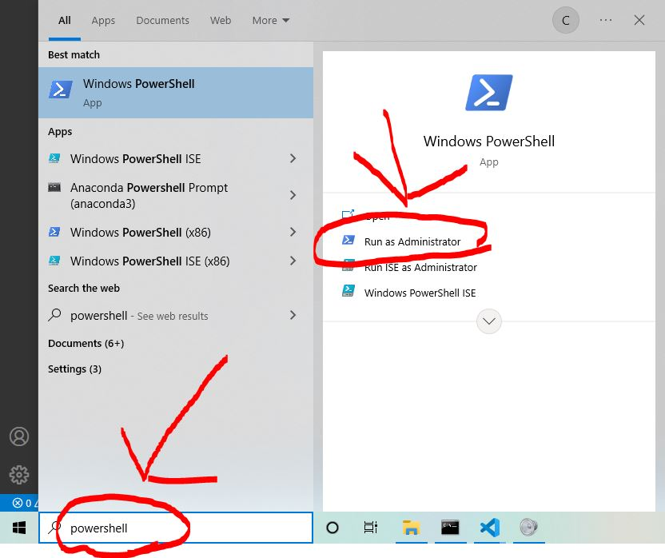

# Windows Subsystem for Linux

<a href="https://imgflip.com/i/6xjlxo"></a><div><a href="https://imgflip.com/memegenerator">from Imgflip Meme Generator</a></div>

UNIX systems are considered ideal by many programmers for software development for a variety of reasons. 
However, the lion's share of computer users use Windows. If you are a software developer running on a 
Windows OS, you are likely to eventually run into limitations with the Command Line Interfaces (CLIs), 
namely, Windows Command Prompt (cmd) and Windows PowerShell.

Installing Linux onto your computer is not necessarily an enormous commitment, but [it's not exactly 
trivial, either][1]. If you are interested in messing around with the functionality of UNIX's "Bash" CLI 
without necessarily committing to a hard drive partition or total replacement of your Windows OS with 
Linux, Windows Subsystem for Linux is a great option and is not difficult to install.

## Installing Windows Subsystem for Linux on Windows 10 or 11

The first step of our installation requires us to open Windows PowerShell _as an administrator_. 
That's a fancy way of saying, "Windows won't let you install WSL unless you prove in Microsoftese that
you know what you are doing." Part of why I bring this up is that you can royally screw up your
computer if you are not careful about what you do in PowerShell. Fortunately for you, you have me to
help you with that.

To open PowerShell as an admin in Windows 10 and 11 is pretty easy. Just search for 'powershell' (case
insensitive) in your Windows search bar (where it says "Type here to search") and you should see an 
option to run PowerShell as an administrator. If you do not see this option, no big deal. You can click
on PowerShell using the right mouse button and Windows will give you the option to run as admin from the 
resultant pop-up menu.



If this is your first time to open a "Command Line Interface", congratulations! It's way less scary than 
it looks. The first command you should enter here is "wsl". Type "wsl" into PowerShell (click on the app 
if you have to do so to get it to accept your typing inputs) and when you're done, click the ENTER key. 
What _should_ happen is that you get the menu that mentions several options. The option you want is
```wsl --install -d Ubuntu```. Type that command in -- try not to have any typos if you can help it -- and hit
ENTER. If you do commit a typographical error, just re-type the command in the same PowerShell window. No
problem.

What is this command doing, exactly? wsl references Windows Subsystem for Linux, --install is a command to 
install, -d is a reference to a "distribution" or version of the Linux OS (kind of like how there is 
Windows 10, 11, and if you're a dinosaur like me, Windows XP or something ancient like that), and Ubuntu 
is the name of the distribution that I recommend installing. (If you change your mind about what Linux 
distribution you would like to use, it is fairly easy to change your installation later.)

When this process is complete, you should be able to search "Ubuntu" in your Windows search bar. Clicking 
the orange symbol for Ubunto should open a Terminal and allow you to run Linux commands. Your Ubuntu 
Terminal should prompt you to choose a username for your Linux Virtual Machine (this is more or less what WSL 
actually is). It will also ask you to write a password. Don't freak out when the password does not show up.
One of Linux's trademark features is _not_ showing passwords as they are typed. Just make sure you know what 
you actually typed, of course.

Sometimes, the above process will run into errors. Usually that's because Windows Subsystem for Linux or 
some other "Windows Feature" that WSL requries is not enabled. To enable it, simply search 'Turn Windows
features on or off' in your Windows search bar, click the icon that shows up in your Windows menu, and
confirm that Virtual Machines and Windows Subsystem for Linux are both enabled.

Cheers! If you made it this far, go buy yourself a coffee or something!

_When your friends ask if you code in Windows or Linux_:


[1]: https://medium.com/linuxforeveryone/how-to-install-ubuntu-20-04-and-dual-boot-alongside-windows-10-323a85271a73